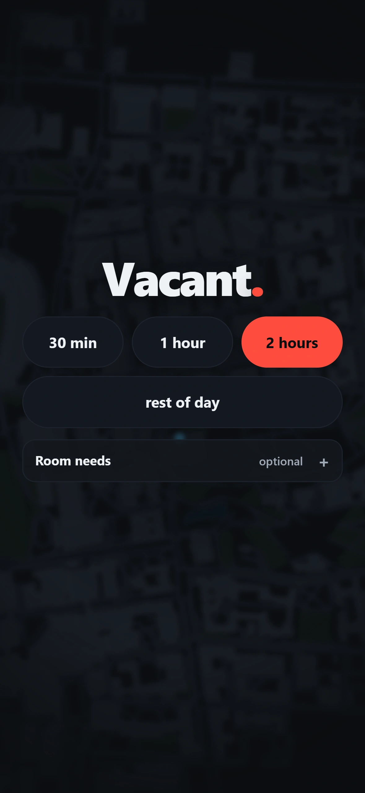
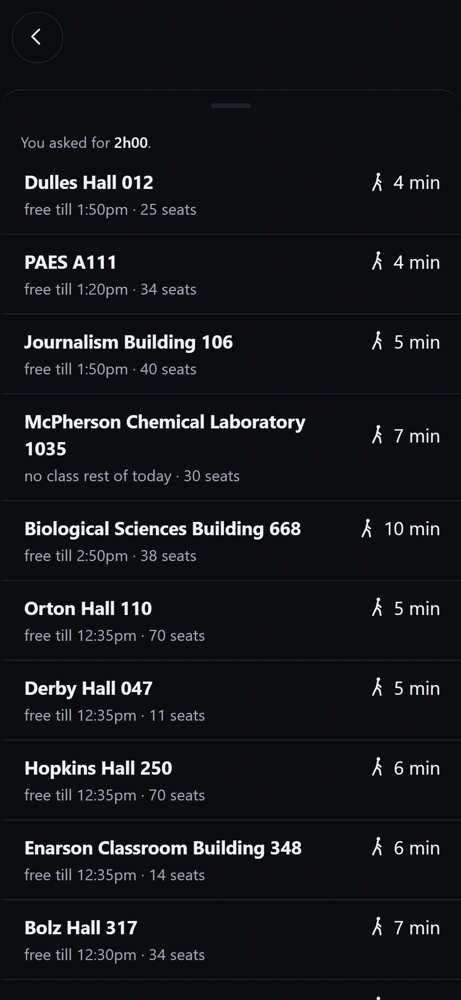
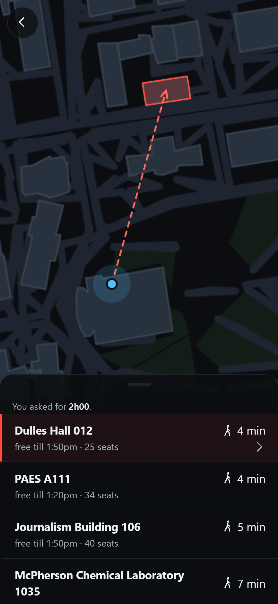
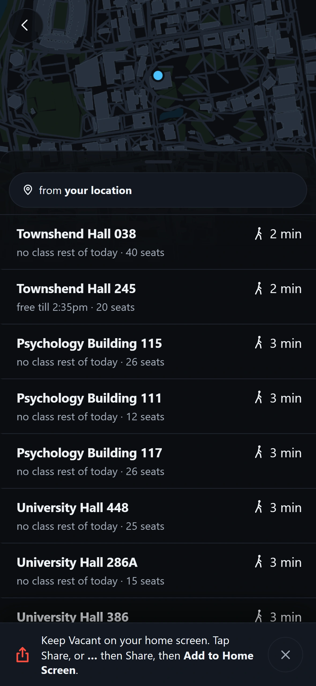

# Vacant

Find an empty classroom near you at Ohio State, free for as long as you need it.

### **[enesyilmazcode.github.io/Vacant](https://enesyilmazcode.github.io/Vacant/)**

It is a web page. No account, no search box, nothing to sign up for. It finds you,
asks one question, and hands you rooms you can walk to, nearest first.

| | | |
| :--: | :--: | :--: |
|  |  |  |
| One question. | The answer. | Where it is. |

## Yours for, not free until

Every other tool answers "is this room free right now". That is the wrong
question, because the room is not where you are standing.

Vacant answers **how long the room is yours once you get there**. It takes the gap
in the room's schedule, subtracts the walk, and leaves ten minutes at the end so
you are not packing up while the next class files in. Walk time is straight line
distance times 1.3 for the fact that campus paths bend, at 78 metres a minute.

Read the third row of the middle screenshot. Psychology Building 217 says **free
till 1:50pm**. The next class in that room starts at 2:00pm, you are three minutes
away, and 1:50pm is when you have to be packed up.

Tap it and the room screen says the same minute, then spells the rest out:
**Yours for 3h27 once you get there.** The two screens agreeing is the point.
They did not for a while: the room screen printed 2:45pm, the raw class start,
handing back the ten minutes the row had already taken off
([#77](https://github.com/EnesYilmazcode/Vacant/issues/77)).

A row that says **no class rest of today** instead of a time means no class is
coming at all, and the timeline behind it ends where the building locks.

| | |
| :--: | :--: |
|  |  |
| Drag the sheet up for the rest. | Tap a room twice for its whole day, doors included. |

## Put it on your home screen

You do not have to. But it is built to be installed, and installing it is what
makes it answer in a stairwell.

On iPhone, open it in Safari and tap Share, or **...** then Share if your tab bar
sits at the bottom, then **Add to Home Screen**. iOS 26 defaults to that Compact
layout, which is why the app offers you both. On Android, Chrome has **Install
app** in its menu.

Installed, the whole app is 70 KB of shell and 63 KB of schedule, gzipped, and
none of it is fetched again to answer a question. Turn the network off, open it,
and it still ranks rooms. That matters because the moment you want it most is the
moment you are in a basement with one bar.

## What it refuses to guess

Vacant reads the class schedule. A class schedule is not a reservation calendar
and it is not a door. Three things are true and the app says all three on screen:

**Doors get locked.** This is the failure every other tool in this category ships
with, and at Ohio State it is avoidable, because the Registrar publishes an open
and close time per building per weekday. Measured against the committed index,
**512 of the 515 rooms have no Saturday class at all this term**. A tool that
stops at the schedule calls all 512 of them free on a Saturday. **367** of those
sit in a building the Registrar publishes as closed that day, and **88** more sit
in a building nobody publishes hours for at all. **57** are in a building that is
genuinely open.

**Hours are not published everywhere.** The Registrar's table covers 47
buildings. The index touches 68. So 90 of the 515 rooms, 17%, are in a building
whose door nobody documents. Those rooms say `hours not published` and rank below
every room that has real hours. They are never given an assumed window, because
"usually open" is a guess wearing the clothes of a fact.

**Clubs book rooms.** A club meeting, a review session or a departmental event is
invisible to every public source, so it is invisible to Vacant too. Every screen
carries that caveat, and [#26](https://github.com/EnesYilmazcode/Vacant/issues/26)
is the plan to go and measure how often it bites.

## How it works

Ohio State publishes, for every class, the room it meets in and the minutes it
occupies. Nobody publishes which rooms are empty. But empty is the complement of
busy, so the whole product is one inversion of a public dataset. A script walks
the class API, drops everything that is not a real Columbus room, and writes a
room-keyed list of busy intervals. The page downloads that file, subtracts today's
intervals from the building's published opening hours, and ranks what is left by
walk time. There is no server, no database, no build step and no dependencies.

Everything the page fetches to produce a ranked list is **fourteen files, 472 KB,
or 108 KB over the wire once gzipped**. Measured with `node:zlib` over the tree
as committed. The campus map is another 98 KB, 38 KB gzipped, and is warmed after
the first answer rather than before it.

| Where | What is in it |
| --- | --- |
| `index.html` | The whole shell. Markup and CSS, no framework. |
| `js/app.js` | Three screens in one sheet: the question, the list, one room. |
| `js/engine.js` | The ranking, and the formula that decides how long a room is yours. |
| `js/map.js` | The campus map, drawn as vectors on a canvas. No tiles, no key. |
| `js/campus.js` | Latitude and longitude into map grid space. |
| `scripts/` | The harvest, the inversion, and the screenshots. |
| `data/` | The committed artefacts the page reads. |

## Run it

```sh
git clone https://github.com/EnesYilmazcode/Vacant.git
cd Vacant
python3 -m http.server 8000     # or any static file server
```

Then open `http://localhost:8000`. It has to be served rather than opened as a
file, because the page is ES modules and it fetches JSON.

```sh
npm test                        # node --test, 589 tests, no network
node scripts/shoot.mjs          # redraw docs/media from the real app
```

### Stand somewhere else, on a different day

Open `http://localhost:8000/?dev=1`, or press **D** three times on any screen.

A panel appears with a date and time control, a slider for the time of day, one
tap jumps to Thanksgiving, finals week, Saturday at 3am and winter break, and a
dropdown of every building in the index. Pick a minute and a place and the app
answers as if you were standing there.

It is not a preview. It moves the same clock every screen reads and the same
origin the ranking measures from, then repaints through the same code path a
duration chip uses, so the answer on screen is the answer a student would get.
The readout at the bottom of the panel says whether the clock is live or
simulated, and it says which rooms came back and why the app refused if it did.

`js/dev.js` is loaded on demand and is not in the service worker's shell list, so
a phone that never asks for it never downloads it.

## Rebuild the data

Nothing here needs a key or an account. Each of these takes `--dry-run`.

```sh
node scripts/fetch-buildings.mjs        # OSU's GIS layer  -> data/buildings.json
node scripts/fetch-campus.mjs           # campus polygons  -> data/campus.json
node scripts/fetch-building-hours.mjs   # Registrar table  -> data/buildings-hours.json
node scripts/fetch-rooms.mjs 1268       # the class schedule -> data/harvest-1268.json.gz
node scripts/build-index.mjs 1268       # invert it        -> data/rooms-1268.json
```

The harvest itself is not committed, because it is regenerated weekly, so a fresh
clone has to run `fetch-rooms` before `build-index`. One pass over the schedule is
136 requests against `content.osu.edu`, sent at about three a second. The
committed Autumn 2026 harvest took four passes and 545 requests, because paging
that API is not deterministic: the harvester repeats until two passes in a row
turn up no meeting in a room it has not already seen. Pass two found thirteen of
them. `data/harvest-1268.manifest.json` records what every pass saw.

`data/raw/1262` and `data/raw/1264` are committed and must stay. Those terms have
already left the API and cannot be refetched at any price.

## Not built yet

- **The list is a room list where it should be a place list.** Forty rows came
  back across thirteen buildings, and one of them took six of them.
  [#62](https://github.com/EnesYilmazcode/Vacant/issues/62).
- **Nobody has walked to a room the app called free and checked.** That is the
  measurement the whole thing rests on and it has not been taken.
  [#26](https://github.com/EnesYilmazcode/Vacant/issues/26) is the walk, and
  `spikes/walk.html` is the checklist to walk it with.

## Roomix

[Roomix](https://roomix.app) is the incumbent at Ohio State and deserves an honest
description. It is a maintained three platform product: a Flutter app with iOS and
Android builds, a backend, accounts, bookmarks, themes, a nearest facility button
and a vacancy search. Anyone calling it a toy has not looked at it.

Two differences are measurable rather than matters of taste. Both were taken off
its own API and its own compiled bundle on 2026-08-26.

It downloads about **3.3 MB** on first launch. Its API is eleven static JSON
files and `courses.json` alone is 2.4 MB.

It has no building hours. Grepping the bundle for "building hours", "holiday" and
"final exam" returns nothing, and `api.roomix.app/hours.json` is a 404. Its
vacancy search also needs a building selected first and then stops at a 200 metre
radius from it, and it prints raw metres rather than walk time.

The full teardown, with the commands, is in
[docs/research/prior-art.md](docs/research/prior-art.md). It also corrects an
earlier draft of this README, which said Roomix was organised building by building
and ignored the clock. Both halves were wrong.

## Docs

- [docs/BACKLOG.md](docs/BACKLOG.md) is the thirty issues, in order.
- [docs/DECISIONS.md](docs/DECISIONS.md) is append only, and records what each
  decision was made against and which measurement settled it.
- [docs/research/](docs/research/) is the measurement itself: the live API, OSU's
  GIS server, the Registrar's table, Roomix's bundle.
- [docs/BLUEPRINT.md](docs/BLUEPRINT.md) is the design note this README used to
  be, kept whole, with the places it turned out wrong marked at the top.
- [scripts/shoot.mjs](scripts/shoot.mjs) regenerates every screenshot above from
  the real app, on a pinned clock and a pinned location, and refuses to write a
  frame of a screen that has not stopped moving. Re-running it on an unchanged
  tree writes the same five files. It also writes down what each screen said, in
  `docs/media/frames.json`, and a test holds the alt text above to it.

## Licence

The code is MIT, in [LICENSE](LICENSE).

The data is derived from Ohio State's own public services: the class schedule at
`content.osu.edu`, the building layer published by OSU Facilities Information and
Technology Services GIS, and the classroom pool schedule from the Office of the
University Registrar. Each file in `data/` carries its source and attribution
inside it. Vacant is not affiliated with Ohio State. How that gets stated on the
site is [#25](https://github.com/EnesYilmazcode/Vacant/issues/25).
